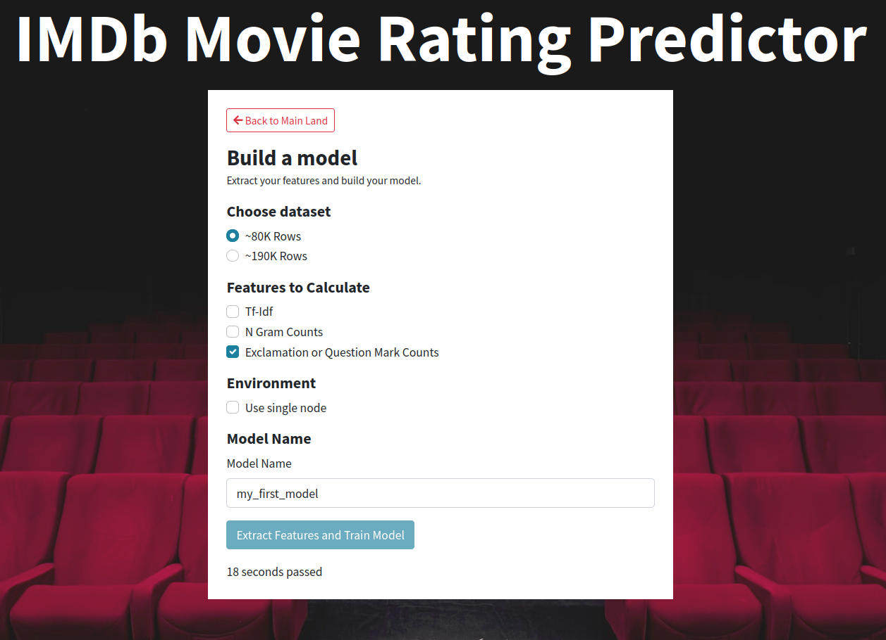
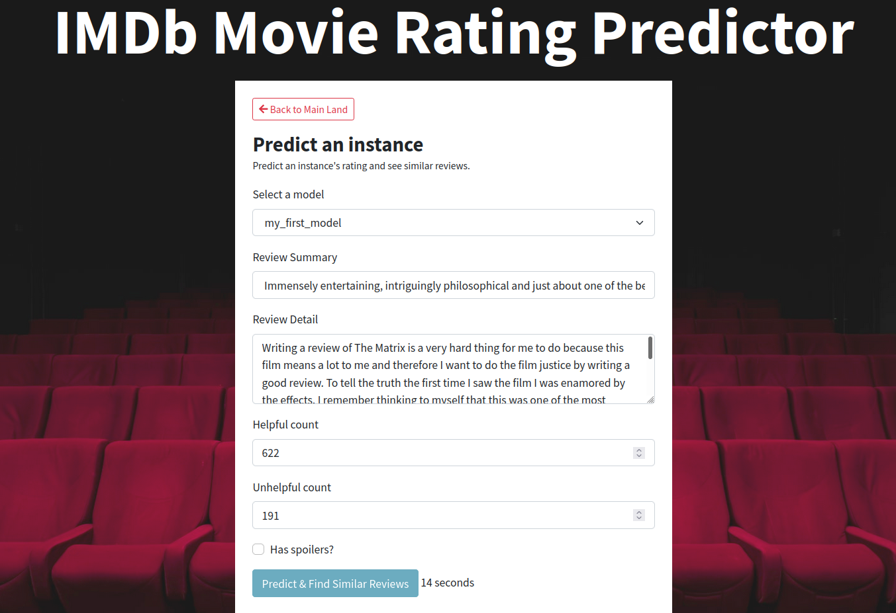
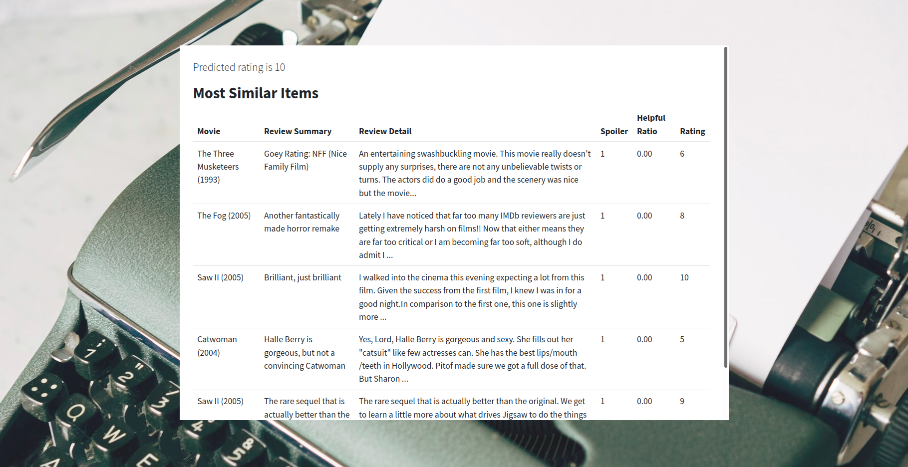

# IMDb Movie Review Rating Prediction
This is an application where you can build models that can predict
ratings of IMDb movie reviews. It works by extracting
important features from [IMDb Largest Review Dataset](https://www.kaggle.com/ebiswas/imdb-review-dataset).
Feature extractor jobs are implemented in
map-reduce fashion and executed on a Hadoop cluster.
Tf-Idf, N-Gram Count and Exclamation/Question Mark Count
features are available for you to extract. After feature 
extraction, a Random Forest Classifier is trained
using the extracted features. Then, you can predict
an unseen instance from the application and see the top 5
similar reviews. Similar scores are found by 
executing a job on hadoop that calculates cosine similarity 
between every review in the dataset and the given review.

## Technical Details
Job implementations are implemented using MRJob 
library in Python. A website is developed using Flask and
JavaScript (Vue.js). You can train models, make a prediction and find similar reviews from the landing page 
of the website.

All of the info related to the model such as selected feature types, model's pickle file, train data, etc. are stored in the
storage system in a separate folder. User can give names 
to the models that they are built. In the prediction,
user can refer to that model name to select that specific model.

## How to Run the Application
First of all, you need an Hadoop cluster 
up and running on your machine. Check out [this](https://medium.com/@jootorres_11979/how-to-set-up-a-hadoop-3-2-1-multi-node-cluster-on-ubuntu-18-04-2-nodes-567ca44a3b12) article for setting up an
Hadoop cluster.

Application is developed on Ubuntu 20 operating system.
Assume that your default pip and python binaries
have the following names: pip3 and python3.

1) Install the necessary libraries:

```bash

pip3 install -r requirements.txt

```

2) Download the dataset. sample.json and part1.json files 
are used in the application. You need to preprocess these 
files.

3) Preprocess both files using the following command:

```bash

python3 processing.py --input /path/to/sample.json –output /output/path/to/preprocessed_sample.csv

python3 processing.py --input /path/to/part1.json –output /output/path/to/preprocessed_part1.csv

```

4) Make a directory in HDFS named /input. Upload the processed datasets to that directory

```bash

hadoop fs -mkdir /input

hadoop fs -put /path/to/preprocessed_sample.csv /input/preprocessed_sample.csv

hadoop fs -put /path/to/preprocessed_sample.csv /input/preprocessed_part1.csv

```

5) Run the application by executing the run.sh file:

```bash

./run.sh

```


## Some Screenshots of the Application

 

 

 

 

 

